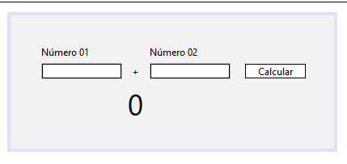

# Calculadora de Soma

> Projeto Feito com Java Swing.

Projeto construído à partir do desafio sugerido pela Faculdade Flamingo.

[Clique aqui para acessar](https://femunniz.github.io/Java_Swing/)

# Tecnologias Utilizadas.

- Java Swing
- Git e Github
